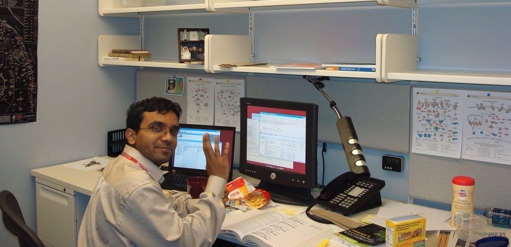

## Hello World!

I work in computational cancer biology for over a decade now. While true scale of *big data* can vary across fields, I work on daily basis to analyze large-scale genomic data on the high-performance computing (HPC) infrastructure. Once every two years or so, I *reset* my HPC environment (env) so as to upgrade major version for programming languages, mainly R and Python. Here, reset as in I force my HPC login :octicons-terminal-16: terminal window to behave as if I am login to HPC for the first time with system defaults. I also prefer doing such hard reset over patching cumulative updates and tips I get from my twitterverse over those two years.

I usually write notes while I do such resets and over years, I have found it quite useful, especially for debugging and when moving to new places with new HPC envs. So, this time, I thought to make these notes available here :fontawesome-solid-globe-africa: with **those starting for the first time in HPC env or even programming on a linux run machine as the primary audience**.

{ align=left width="300" }

I [started my journey in computational biology at Dana-Farber](https://sbamin.com/about "About me") back in 2008. The entire programming env was quite new and daunting to me with no prior experience in programming. I recollect typing `cd`, `chdir`, etc. commands in Windows(r) DOS [terminal](https://en.wikipedia.org/wiki/Terminal_emulator) for not more than an hour when our teachers *introduced* us about computers during my high-school years! Nonetheless, I got curious looking at that terminal :fontawesome-solid-terminal: and then arrival of the internet during my medical school years fueled my curiosity and helped me get familiar with computers. I was not skilled and in fact, far from comfortable the time I joined Dana-Farber but along the ride, I was helped by my colleagues and mentors, and those with whom I'd not interacted in-person: In particular [Hadley Wickham](http://hadley.nz/) and [tidyverse team](https://www.tidyverse.org/) for sharing an excellent documentation on programming in R and countless users at [stackoverflow](https://stackoverflow.com/) and [biostars](https://www.biostars.org/) forums for sharing their ideas and bugfixes. So, it's *paying it forward* time and hope some of you find this documentation useful and a step closer towards a skilled programmer.

!!! info "Scope of this documentation"
    I must say though that this website is more geared towards getting you started with linux computing and an attempt to lower the resistance to working on the terminal :octicons-terminal-16:, i.e., to set up a stable linux env so that you can focus on learning programming instead of debugging on why certain commands or program fail to work.

    That said, this website is not intended to teach you on how to program in R or Python or other languages. I am certain that there are several excellent online course and textbook materials available for such learning. I will add a few of my favorite materials here in the future.

    I have tried to provide logic behind most of commands, including external links for technical words. However, you may find several keywords or phrases as jargon, e.g., you may wonder what `pip install` is or what is kernel? In such cases, I suggest to at least do a web search and familiarize yourself on what those words/phrases mean and why they could be relevant as you master your programming skills.

## Getting Started

To get started, I have partitioned documentation into two major sections. The **first section (CPU Computing)** details - in three parts - how to setup HPC env using [conda](https://conda.io) based package management system.

*   In [Part 1](cpu/sumner_1/), we will start with HPC setup either from the scratch as in login to HPC on the day one or will reset or overhaul an existing HPC env[^1]. We will install conda and set a default and minimal bash startup profile.
*   In [Part 2](cpu/sumner_2/), we will setup two or more dedicated conda env to host commonly used programming languages in computational biology: R along with Python 3 that ships with conda. We will also setup [Jupyter Lab](https://jupyter.org), a popular user interface similar to [RStudio](https://www.rstudio.com/) to interact with hosted programming languages and files over the secure internet browser.
*   Finally, in [Part 3](cpu/sumner_3/), we will charge up our HPC env by adding [Julia](https://julialang.org/) - another popular language in computational biology. We will also install a few drivers and jupyter kernels to interact with externally hosted databases like SQL or postgresql. I will also outline setting up [Modules](https://modules.readthedocs.io), [Snakemake](https://snakemake.readthedocs.io)-based workflows, and [Singularity](https://sylabs.io/guides/latest/user-guide/introduction.html) container system. Finally, we will launch our custom HPC env using a mighty *bash startup* sequence 

**Second section (GPU computing)** is an optional setup and intended for those working on GPU-enabled HPCs. We will walk through setting up commonly used GPU libraries, e.g., [Tensorflow 2](https://www.tensorflow.org/), [Keras](https://keras.io/about/), and [PyTorch](https://pytorch.org/). I am going to update this section in the near future.

[^1]: Preferably requires prior working experience with HPC env and following cautionary notes I have placed to do such reset.

## Feedback

Source code of this website is available at {{ config.extra.repo.url }}. I welcome user contributions, including bugfixes, enhancements, and alternative approaches. Since I update my linux env once every two years or so, I will not be updating this website often. If I encounter major bugs in my working env, I will update this website accordingly.

Please use [github issues]({{ config.extra.repo.url }}/issues) and [pull requests]({{ config.extra.repo.url }}/pulls) for all forms of communications and of course, you can tag/follow me :material-twitter: at [@sbamin](https://twitter.com/sbamin).

## Acknowledgments

Big shout-out to [Martin Donath](https://github.com/squidfunk) for sharing this great documentation ecosystem at [Material for MkDocs](https://squidfunk.github.io/mkdocs-material/). Over last three years, it has helped me a lot in documenting my daily work, progress notes, etc.
